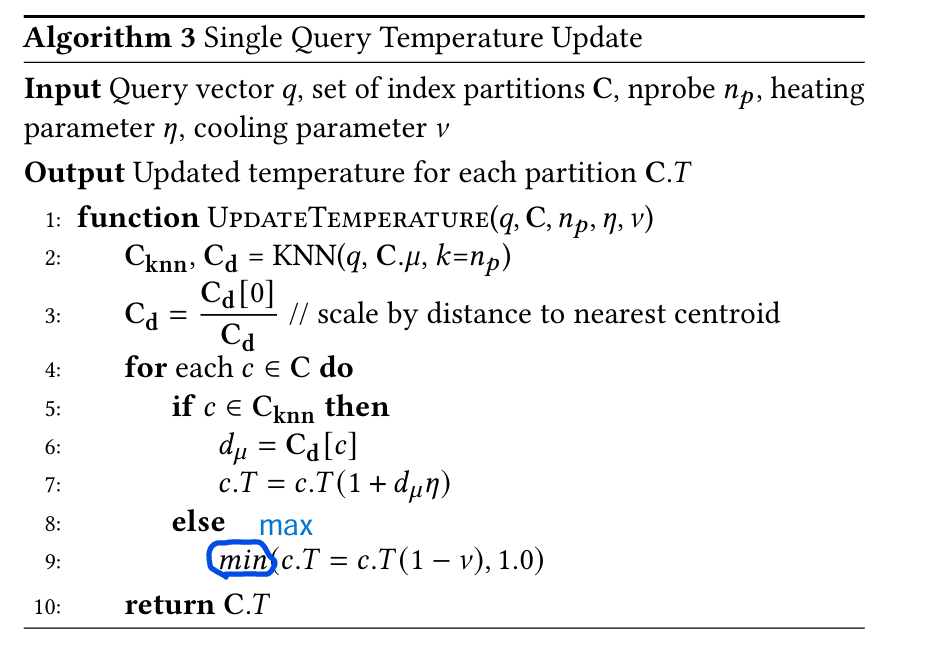
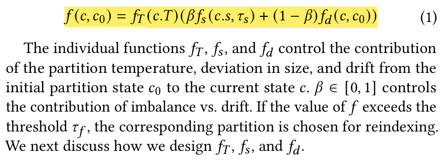
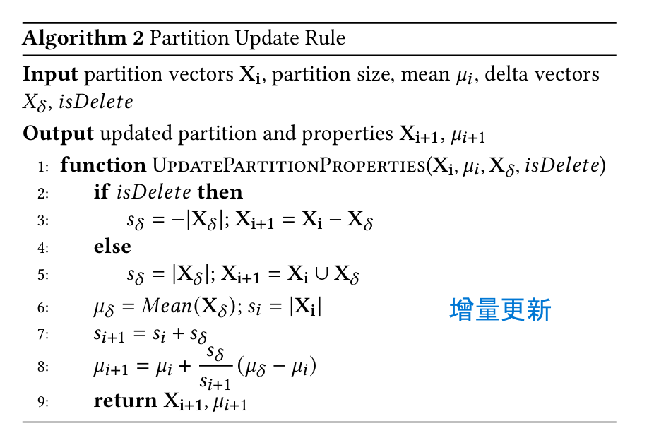
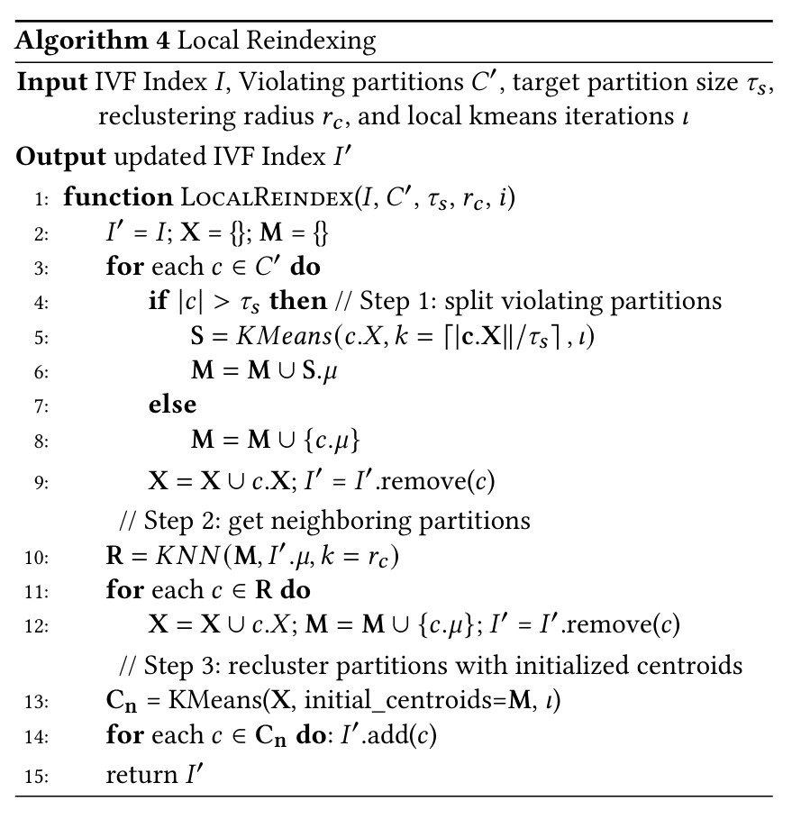
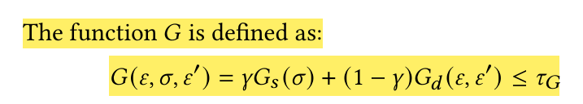

## 运行说明
### 关于历史版本
- 原有IVF (SPFresh) 保留在``IVF.cpp``, ``IVF.h``中
- 原有K-means保留在``Kmeans.cpp``, ``Kmeans.h``中

原有代码均未修改，添加了Makefile，可以直接make运行(运行前请修改链接库路径为自己的路径)，得到SPFresh的运行结果

- 使用``main_rawdim.cpp``进行测试

---

### 关于AdaIVF
#### 相关文件如下：
文件名 | 功能 
---|---
``AdaIVF.cpp``, ``AdaIVF.h`` | AdaIVF的实现文件，在原有IVF的基础上进行修改
``B_k_means.cpp``, ``B_k_means.h`` | Balanced K-means, K-means++的实现文件

#### 已实现功能：
功能 | 代码 | 论文对应 
---|---|---
AdaIVF类定义 | ``AdaIVF.h`` | 
温度更新 | ``IVFIndex::update_temperature()`` | 
聚类评分 | ``IVFIndex::calculate_reindexing_score()`` | 

#### 正在实现功能（因为代码丢了所以在重写）：
功能 | 代码 | 论文对应
---|---|---
Balanced K-means, K-means++ | ``B_k_means.cpp`` | 用于初始中心选择和违规聚类分裂的更好用的Kmeans
聚类中心增量更新 | ``IVFIndex::update_centroid()`` | 
Local Reindexing | ``IVFIndex::local_reindex()  ``对于需要重新更新的违规聚类，通过分裂和合并得到更好的聚类结果 | 

#### 后续需要实现:
功能 | 说明 | 论文对应
---|---|---
Global Reindexing | 函数，评价是否需要全量构建，返回一个评分 | 
Check Reindexing | 函数，先检测违规聚类，然后调用Local Reindexing。然后检测是否需要全量重建，对于需要全量重建的，重构 | 
增删操作 | 所有涉及改变数据的操作，调用Check Reindexing | /
